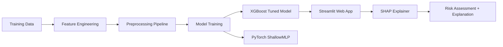

# 🌾 Agricultural Micro-Loan Default Prediction

> **Empowering Kenyan Farmers and SACCOs with AI-Driven Credit Decisions**

[](https://ngao-labs-project.streamlit.app)
[](https://www.python.org/downloads/)
[](https://opensource.org/licenses/MIT)

An end-to-end Machine Learning and Explainable AI (XAI) solution for predicting micro-loan defaults in agricultural finance. Built as a capstone project for **Ngao Labs**, this system evaluates loan requests against historical credit performance, transaction behavior, and applicant demographics — while providing transparent, per-prediction explanations using SHAP.

---

## 📑 Table of Contents

- [Problem Statement](#-problem-statement)
- [Key Features](#-key-features)
- [Project Architecture](#-project-architecture)
- [Dataset](#-dataset)
- [Methodology](#-methodology)
- [Model Performance](#-model-performance)
- [Web Application](#-web-application)
- [Installation & Setup](#-installation--setup)
- [Deployment on Streamlit Cloud](#-deployment-on-streamlit-cloud)
- [Project Structure](#-project-structure)
- [Key Findings](#-key-findings)
- [Responsible AI](#-responsible-ai)
- [Contributors](#-contributors)

---

## 🎯 Problem Statement

Kenyan microfinance institutions and SACCOs face significant financial risk from loan defaults in the agricultural sector. Manual credit assessments are slow, inconsistent, and prone to bias. This project automates default risk prediction by leveraging machine learning, enabling:

- **Faster loan processing** with real-time risk scoring
- **Reduced default rates** through data-driven decision-making
- **Transparent lending** with explainable AI reasoning for every prediction

---

## ✨ Key Features

| Feature | Description |
|---|---|
| 🤖 **XGBoost Model** | Tuned gradient-boosted ensemble achieving strong AUC-ROC performance |
| 🔍 **SHAP Explanations** | Per-prediction feature impact analysis using native XGBoost SHAP values |
| 🌐 **Interactive Dashboard** | Streamlit web app with real-time scoring and visual explanations |
| 🌙 **Dark/Light Mode** | Toggle between themes for comfortable viewing |
| ⚖️ **Responsible AI** | Fairness audits, transparency disclaimers, and bias-aware modeling |
| 📊 **Class Imbalance Handling** | SMOTE + threshold tuning to catch defaults without over-penalizing good borrowers |

---

## 🏗️ Project Architecture



---

## 📊 Dataset

The project uses three relational datasets from a Kenyan micro-lending institution:

| Dataset | Records | Features | Description |
|---|---|---|---|
| `traindemographics.csv` | 4,346 | 9 | Applicant demographics (age, employment, education, bank) |
| `trainprevloans.csv` | 18,183 | 12 | Historical loan records (amounts, terms, repayment dates) |
| `trainperf.csv` | 4,368 | 10 | Current loan performance with target variable (`good_bad_flag`) |

**Target Variable**: `good_bad_flag` → Binary classification (`Good` = Repaid, `Bad` = Defaulted)

**Class Distribution**: ~80% Repaid vs ~20% Defaulted (significant imbalance addressed via SMOTE and threshold tuning)

---

## 🔬 Methodology

### 1. Data Preprocessing & Feature Engineering

- **Behavioral Features**: Repayment delay days, late payment indicators, interest accrued, loan intensity
- **Per-Customer Aggregations**: Total previous loans, average repayment delay, late repayment ratio, on-time repayment rate
- **Demographic Derivatives**: Age at loan application (computed from birthdate and loan creation date)

### 2. Preprocessing Pipeline (`ColumnTransformer`)

| Feature Type | Transformer | Examples |
|---|---|---|
| Numerical | `StandardScaler` | `loanamount`, `totaldue`, `age_at_loan`, `mean_repay_delay` |
| High-Cardinality Categorical | `TargetEncoder` | `bank_name_clients` |
| Low-Cardinality Categorical | `OneHotEncoder` | `employment_status`, `bank_account_type`, `education_level` |

### 3. Class Imbalance Strategies

- **SMOTE** (Synthetic Minority Over-sampling) for training set augmentation
- **Cost-sensitive weighting** (`scale_pos_weight` in XGBoost)
- **Optimal threshold tuning** (from default 0.5 to ~0.20–0.35) to maximize default recall

### 4. Model Architectures

| Model | Architecture | Purpose |
|---|---|---|
| **XGBoost Tuned** | Gradient-boosted trees, tuned via `RandomizedSearchCV` (3-fold CV, 15 iterations) | Primary production model |
| **PyTorch ShallowMLP** | `Input → 128 → 64 → 1` with BatchNorm, ReLU, 30% Dropout | Benchmark neural network |
| **PyTorch DeepTabNet** | `Input → 256 → 128 → 64 → 32 → 1` with LeakyReLU, heavier Dropout | Deep tabular comparison |

---

## 📈 Model Performance

- **Primary Metrics**: AUC-ROC, F1-Score, and Default Recall (prioritized over raw accuracy)
- **XGBoost Tuned** achieved top overall performance with **Validation AUC-ROC ~0.72+**
- **Threshold Optimization** significantly improved default class recall, reducing missed defaults

### Visualization Samples

<details>
<summary>📊 Click to expand performance charts</summary>

| Chart | Description |
|---|---|
| `AUC & ROC Curves.png` | ROC curves comparing all model architectures |
| `Comparative F1 score with SMOTE.png` | F1-score improvements after SMOTE |
| `Confusion Matrixes.png` | Baseline confusion matrices |
| `Confusion Matrixes with tuned XGboost threshold.png` | Recall-optimized confusion matrices |
| `Data distribution and Correlation.png` | EDA: class distribution and feature correlations |

</details>

---

## 🌐 Web Application

The **AgriLoan Predictor** is an interactive Streamlit dashboard for real-time loan risk assessment.

### Features

- **Loan Details Input**: Amount (KES), term days, total due
- **Applicant Demographics**: Age, employment status, education level
- **Banking Details**: Bank name, account type
- **Advanced Credit History** (optional): Previous loans, repayment delays, late payments
- **Real-Time Prediction**: Color-coded risk assessment (High Risk 🔴 / Low Risk 🟢)
- **SHAP Explanations**: Top 10 features ranked by impact with visual bars
- **Narrative Summary**: Plain-English explanation of key risk/safety factors
- **Dark/Light Mode**: Toggle with 🌙 button
- **Responsible AI Notice**: Transparency disclaimer on every prediction

### Screenshots

The app provides:
1. A clean input form for loan and applicant details
2. A prediction result with confidence percentage
3. A detailed SHAP explanation section showing which factors influenced the decision

---

## 🚀 Installation & Setup

### Prerequisites

- Python 3.12+
- pip

### Local Setup

```bash
# Clone the repository
git clone https://github.com/KalonzoBrian/Ngao-Labs-Project.git
cd Ngao-Labs-Project

# Create virtual environment
python -m venv webapp/venv

# Activate virtual environment
# Windows:
webapp\venv\Scripts\activate
# macOS/Linux:
source webapp/venv/bin/activate

# Install dependencies
pip install -r webapp/requirements.txt

# Run the app
streamlit run webapp/app.py
```

The app will open at `http://localhost:8501`

---

## ☁️ Deployment on Streamlit Cloud

This project is configured for seamless deployment on [Streamlit Community Cloud](https://streamlit.io/cloud):

1. Push the repository to GitHub
2. Go to [share.streamlit.io](https://share.streamlit.io)
3. Connect your GitHub repository: `KalonzoBrian/Ngao-Labs-Project`
4. Set the **Main file path** to: `webapp/app.py`
5. Click **Deploy**

> **Note**: The `Model/` directory containing `loan_preprocessor.joblib` and `xgb_tuned_baseline.json` must be included in the repository for deployment to work.

---

## 📁 Project Structure

```
Ngao-Labs-Project/
│
├── README.md                          # This file
├── .gitignore                         # Git ignore rules
├── rebuild_preprocessor.py            # Script to rebuild preprocessor with current sklearn
├── run_webapp.bat                     # Windows batch launcher
│
├── Model/                             # Trained model artifacts
│   ├── loan_preprocessor.joblib       # Fitted sklearn ColumnTransformer
│   ├── xgb_tuned_baseline.json        # Tuned XGBoost model
│   └── shallow_mlp_state_dict.pth     # PyTorch MLP weights
│
├── webapp/                            # Streamlit web application
│   ├── .streamlit/
│   │   └── config.toml                # Green theme configuration
│   ├── app.py                         # Main Streamlit application
│   ├── model_handler.py               # Model loading, prediction & SHAP
│   └── requirements.txt               # Python dependencies
│
├── Agricultural Micro-Loan Default Prediction.ipynb  # Full analysis notebook
│
├── Findings.docx                      # Project findings document
├── Project Proposal.docx              # Capstone project proposal
├── Break Week - Ngao Labs.pdf         # Assignment brief
│
├── *.png                              # Model performance visualizations
│   ├── AUC & ROC Curves.png
│   ├── Comparative F1 score with SMOTE.png
│   ├── Confusion Matrixes.png
│   ├── Data distribution and Correlation.png
│   └── ...
│
└── training datasets/                 # Raw training data (not pushed to GitHub)
    ├── traindemographics.csv
    ├── trainperf.csv
    └── trainprevloans.csv
```

---

## 🔑 Key Findings

1. **Top Risk Drivers**: Repayment delays (`mean_repay_delay`, `max_repay_delay`), `late_repayment_ratio`, and high loan intensity (`loanamount / termdays`) are the strongest predictors of future default.

2. **Threshold Tuning > SMOTE**: Adjusting the XGBoost classification threshold (from 0.5 to ~0.25) was more effective than SMOTE alone for catching actual defaults.

3. **XGBoost Outperforms Neural Networks**: On this tabular dataset, the tuned XGBoost ensemble consistently outperformed both the ShallowMLP and DeepTabNet architectures.

4. **Feature Engineering Matters**: Engineered behavioral features (repayment delay ratios, on-time repayment rates) had higher predictive power than raw demographic features alone.

---

## ⚖️ Responsible AI

This project implements several Responsible AI practices:

- **Explainability**: Every prediction includes SHAP-based feature impact analysis, providing loan officers with clear reasoning behind each recommendation.

- **Fairness Audit**: Disaggregated AUC-ROC analysis across employment status sub-groups (`Permanent`, `Self-Employed`, `Student`, `Unemployed`, `Retired`) demonstrated consistent model performance, reducing algorithmic bias risk.

- **Transparency Disclaimer**: The web application includes a prominent notice that the AI is a decision-support tool — not a replacement for human judgment, institutional policies, and regulatory guidelines.

- **No Black Box**: The system does not simply output a "Yes/No" — it explains *why*, showing which specific factors (loan amount, repayment history, employment status, etc.) influenced the decision.

---

## 👥 Contributors

| Name | Role |
|---|---|
| **Ngao Labs Capstone Team** | Data Science, ML Engineering, Web Development |

---

## 📄 License

This project is developed as part of the Ngao Labs Capstone Program.

---

<div align="center">

**Built with ❤️ for Kenyan Agricultural Finance**

*Empowering farmers, one loan at a time* 🌾

</div>
